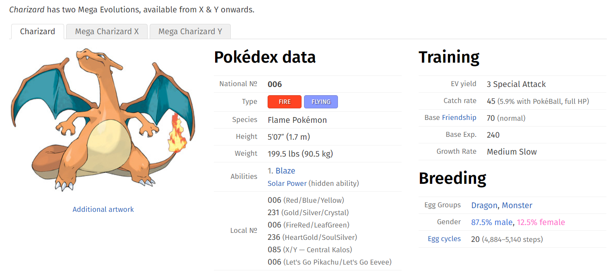

# DAT-129
## Pokemon Website Scraping

Took pokemon name, id, type, and effectiviness from a [pokemon database][idx] and made a text file of the id, name, and type with json,  html, beautiful soup, requests, and regular expressionsso others may use the data for their own purposes. The website and program can also be used to find out a variety of different things about pokemon and list them out in an easy format for people to understand. 

## Complications

There were many aspects of the website that we wished to scrape but unfortunately some of the data was difficult to obtain due to the new mechanics added to the later generation of games. For example: 

Pokemon that have mega-evolutions used some of the tags that we were previously calling and made it difficult for us to get information on items such as ability.

[idx]:https://pokemondb.net/pokedex/national
