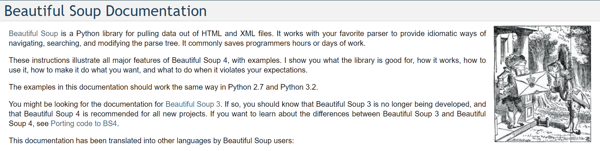

# Website scraping (html/bs4)
## Learned to use bs4 

Code that takes the html from a website describing pokemon and scraping the id number, name, and type of the pokemon.
In Eric Darsow's class using [Eric Darsow's website][idx]

    this is computer <code> that is automatically <escaped "wacko">

## Coding resources
[Python bs4 module official documentation](https://www.crummy.com/software/BeautifulSoup/bs4/doc/)

## Uses for we  scraping
* Learning the ins and outs of bs4/html
* Extracting data form websites which don't run a formal data extraction API
* Exploring tree-based data structures

[idx]:https://technologyrediscovery.net/
